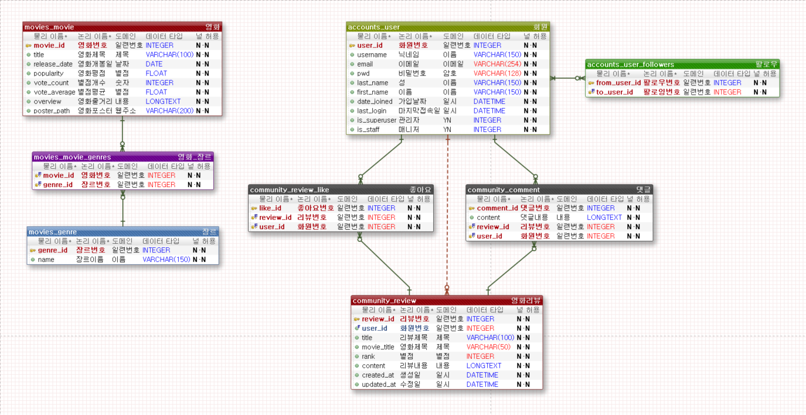

# pjt-final

### 1학기 최종 프로젝트 (MOVIE_IS_AWESOME)

#### 서론) 프로젝트를 진행하기에 앞서

**i. 팀원 정보 및 업무 분담 내역** 

이동철:

이유현:

**ii. 목표 서비스 구현 및 실제 구현 정도** 

##### *주의사항

1. 반드시 git pull origin develop 을 해서 변경사항이 있는지 확인한다.
2. 반드시 branch 를 만들어서 작업을 진행한다.
3. merge conflict 가 발생하지 않도록 진행하는 부분을 동시에 진행하지 않는다.
3. git의 main branch는 devleop으로 default 해두었습니다. (master는 배포를 위한 공간)

##### *GIT의 흐름 (예시)

1. git pull origin develop

2. git checkout -b feature/FE_login 또는 git checkout -b feature/BE_movieApi

    (작업을 시작하고, 완료가 된다면)
    
3. git add .

4. git commit -m "FE_login(만든 기능) complete"

5. git push origin feature/FE_login(만든 기능) (develop 또는 master 가 아님을 주의)

    (gitlab 으로 이동해서)

6. gitlab에서 create merge

    (delete source 체크되어있는지 확인)
    
    (merge 방향이 맞는지 확인 ( ex) feature/FE_login into develop) )
    
7. git checkout develop 

    (develop 브랜치로 이동하면, 아직 반영이 안되어있음을 알 수 있음)

8. git pull origin develop (pull 해주면 반영 완료)

9. git branch -D feature/FE_login (사용한 branch 는 삭제)

------

**본론) 프로젝트 상세 설명**

**iii. 데이터베이스 모델링(ERD)** 

**iv. 필수 기능에 대한 설명** 

**v. 배포 서버 URL** 

**vi. 기타(느낀점)**

