# 🏆Final pjt

### SSAFY 최종 프로젝트 (팀명: SSINEMA)

- **이동철** - Frontend (팀장)
- **이유현** - Backend


## 프로젝트 목표

> **Django REST API와 Vue.js를 활용한 영화 추천 및 커뮤니티 사이트 제작**

- 한 학기 동안 사용한 모든 것을 활용해서 제작할 것

- Backend와 Frontend의 역할 분담을 하지만, 

  팀원 모두가 프로젝트 전체를 이해할 수 있도록 협업을 위주로 할 것

- 의견을 수시로 나누면서 팀원과 프로젝트 진행 상황을 공유할 것


## **"SSINEMA"**

> SSAFY + CINEMA


## 배포 주소

> ssinema.net


## **개발 기간**

- 2021.11.16 ~ 2021.11.26


## 결과물 Preview

- 로그인 & 회원가입

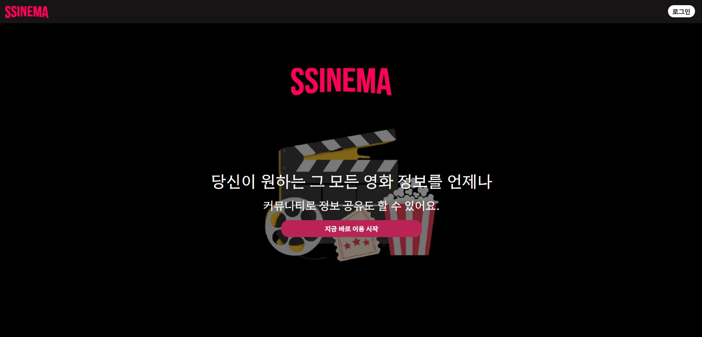

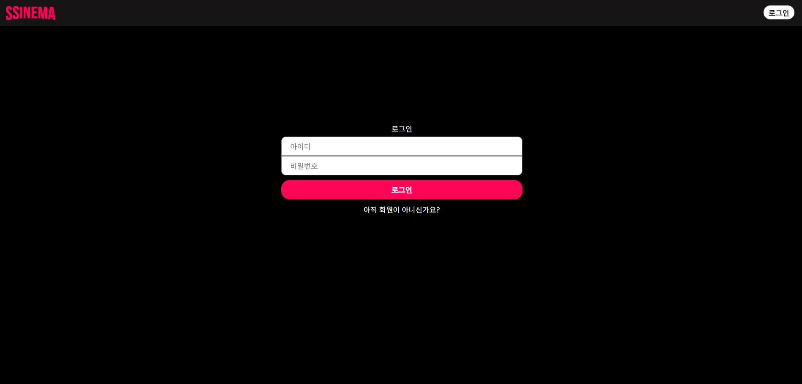

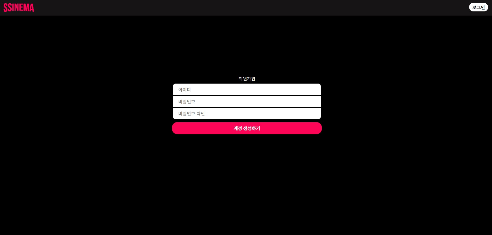


- 메인 페이지

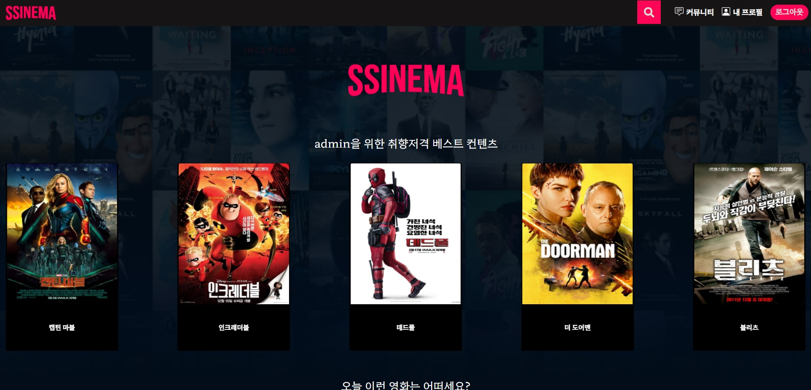


- 메인 페이지 - 영화 검색  & 조회

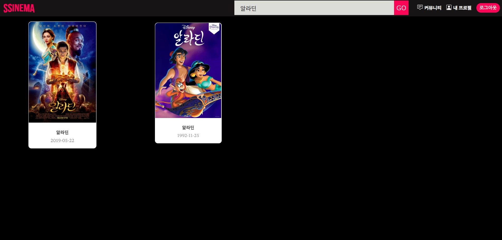

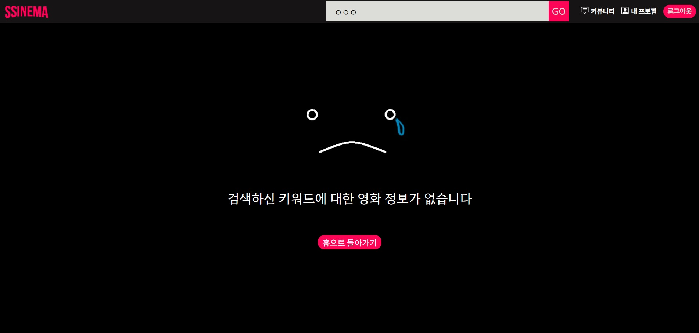


- 영화 상세 페이지 - Youtube & Star Point & Review

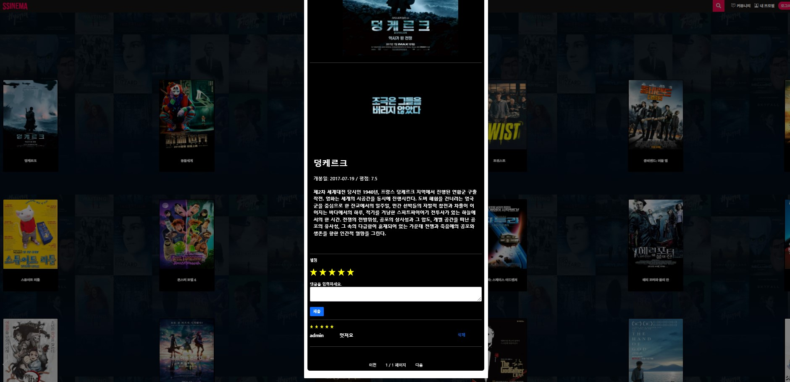


- 게시판 페이지 - CRUD & Liked

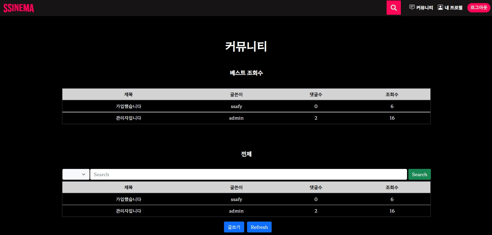

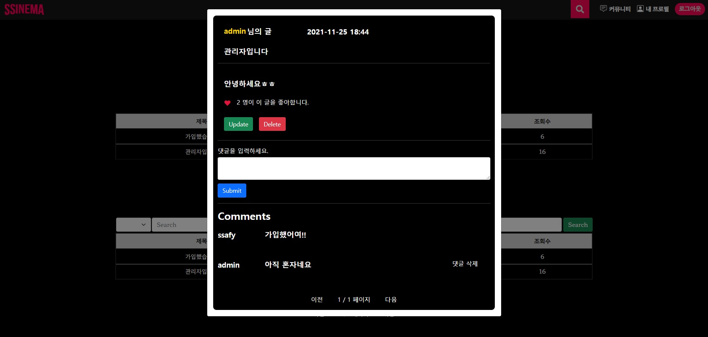


- 프로필 페이지

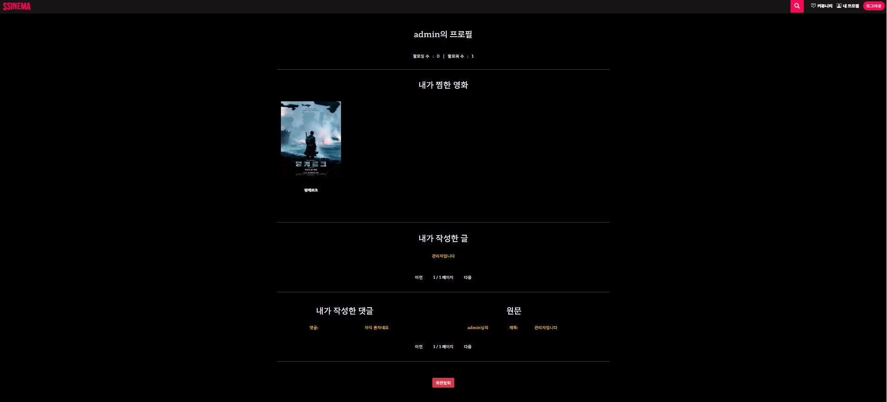


- 다른 유저의 프로필 페이지 - Follow

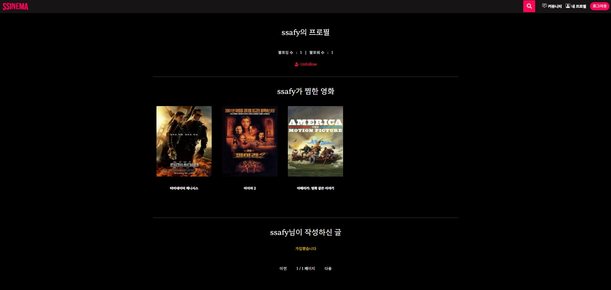


- 없는 도메인 접근 시 (404)

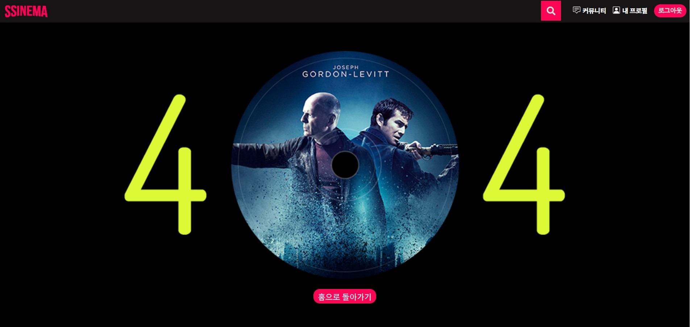


## 개발 환경

### 1. 개발 스택

- Python
- Django
- SQLite
- HTML
- CSS
- JavaScript
- Vue.js
- Vuex
- AWS
- Netlify


### 2. 설치

- python

```
python -m venv venv
source venv/Scripts/activate
pip install -r requirements.txt
python manage.py migrate
python manage.py runserver
```

- vue

```
npm i
npm run serve
```


## GIT의 흐름

#### 개발 진행 중에 GIT 사용 흐름


##### 주의사항

1. 반드시 git pull origin develop 을 해서 변경사항이 있는지 확인한다.
2. 반드시 branch 를 만들어서 작업을 진행한다.
3. merge conflict 가 발생하지 않도록 진행하는 부분을 동시에 진행하지 않는다.
3. git의 main branch는 devleop으로 default 해두었습니다. (master는 배포를 위한 공간)


##### GIT의 흐름 (예시)

1. git pull origin develop

2. git checkout -b feature/FE_login 또는 git checkout -b feature/BE_movieApi

    (작업을 시작하고, 완료가 된다면)
    
3. git add .

4. git commit -m "FE_login(만든 기능) complete"

5. git push origin feature/FE_login(만든 기능) (develop 또는 master 가 아님을 주의)

    (gitlab 으로 이동해서)

6. gitlab에서 create merge

    (delete source 체크되어있는지 확인)
    
    (merge 방향이 맞는지 확인 ( ex) feature/FE_login into develop) )
    
7. git checkout develop 

    (develop 브랜치로 이동하면, 아직 반영이 안되어있음을 알 수 있음)

8. git pull origin develop (pull 해주면 반영 완료)

9. git branch -D feature/FE_login (사용한 branch 는 삭제)


------


## Design Thinking

#### 1. Target

OTT 서비스 이용자 수의 증가에 따라서, 해당 서비스를 이용하기 전에

최적의 콘텐츠를 추천받고 싶은 사용자를 위한  WEB 어플리케이션 제작


#### 2. Why

국내에 도입되는 OTT 서비스가 많아짐에 따라, 각 OTT가 지닌 콘텐츠들도 다릅니다.

그래서 자신이 좋아하는 장르, 혹은 영화사 등의 정보를 미리 파악할 수 있도록 하면

추후 해당 OTT 서비스를 고르고 이용하기 편해진다고 생각했습니다.


#### 3. How

1. 가입 후, 메인페이지에서 업데이트되는 DB를 기반으로 불러오는 영화 목록에서,

   본인이 재미있게 본 영화를 발견하면 별점과 코멘트를 작성할 수 있습니다. 

   별점을 7점 이상 부여 시, 찜한 목록에 들어가서 해당 장르를 기반으로 한 알고리즘을 통해 

   메인페이지에서 제공되는 추천 영화 목록이 변경되어 나타납니다.

2. 계절에 따라, 날씨에 따른 알고리즘 설계를 통해 제공되는 추천 영화 목록이 변경됩니다.

   이를 통해, 사용자가 다양한 영화의 정보를 파악할 수 있습니다.

3. 기본적으로 평점높은 영화, 개봉된 (혹은 개봉 예정인) 영화, 인기있는 영화를 DB 업데이트를 통해

   매번 다른 영화 목록을 제공하고 있습니다.

   

## ERD


- 주 모델: 영화, 게시글, 유저
- 모델 관계
  - 영화ㅡ리뷰 (1:N)
  - 영화ㅡ장르 (M:N)
  - 게시글ㅡ유저 (M:N)
  - 게시글ㅡ댓글 (1:N)
  - 유저ㅡ팔로우 (M:N)
  - 유저ㅡ리뷰 (M:N)
- 유저 영화 리뷰 별점 (추천 알고리즘)
  - 유저에게 영화를 추천하는 알고리즘을 짜기 위해 생성한 관계
  - 유저가 평점을 준 영화의 장르 정보들을 통해서 유저에게 영화를 추천


## Back end

#### 0. 구조

- final_pjt_back-(프로젝트)
- accounts-(계정 앱)
- articles-(커뮤니티 앱)
- movies-(서비스 관련 앱)
  - category-(영화 서비스 제공을 위한 앱)
- dummy(data / DataSet)-(영화데이터 추출 및 입력을 위한 실험 앱)


#### 1. TMDB API를 활용한 DB 구축

```python
class TMDBHelper:
    """API 요청에 필요한 기능들을 제공합니다.
    """

    def __init__(self):
        self.api_key = config('API_KEY')


    def create_movies(self):
        URL = f"https://api.themoviedb.org/3/movie/popular?api_key={self.api_key}&language=ko-KR&page="
        for pageNum in range(1, 101):
        # for pageNum in range(1, 2):
            res = requests.get(URL + str(pageNum)).json()

            movie_list = res['results']
            for movie in movie_list:
                movie_id = movie['id']

                if Movie.objects.filter(movie_id=movie_id).exists():
                    continue

                else:
                    title = movie['title']
                    vote_average = movie['vote_average']
                    vote_count = movie['vote_count']
                    popularity = movie['popularity']      
                    overview = movie["overview"]
                    poster_path = movie["poster_path"]
                    genre_ids_list = movie["genre_ids"]

                    try:
                        release_date = datetime.datetime.strptime(movie["release_date"], "%Y-%m-%d").date()
                        VIDEO_URL = f"https://api.themoviedb.org/3/movie/{movie_id}?api_key={self.api_key}&append_to_response=videos"
                        video_res = requests.get(VIDEO_URL).json()
                        video_result = video_res["videos"]["results"]
                        video_path = None
                        if video_result:
                            video_path = video_result[0]['key']

                    except:
                        continue

                    movie = Movie.objects.create(
                        movie_id = movie_id,
                        title = title,
                        vote_average = vote_average,
                        vote_count = vote_count,
                        popularity = popularity,
                        release_date = release_date,
                        overview = overview,
                        poster_path = poster_path,
                        video_path = video_path
                    )

                    for genre in genre_ids_list:
                        genre_object = Genre.objects.get(genre_id=genre)
                        movie.genres.add(genre_object)

        return print('complete_movie_saved')
```

- `TMDBHelper` 클래스와 `create_movies` 함수를 통해 TMDB에 존재하는 영화 데이터 약 1,000개를 가져와 `for`문을 통해 각각의 정보를 순회하며 필드명을 변수명으로 지정한 후 데이터들을 할당
- `Model.objects.create`를 사용하여 각 영화당 객체를 생성하여 DB에 저장
- 장르들을 담은 `genre_list`를 `for`문을 통해 순회하며 각각의 장르와 `Genre`테이블의 `genre_id`필드와 일치하는 객체를 변수에 담아 `변수.중개모델manage.add(모델)`로 중개모델 데이터 추가
- `TMDB API`의 기능 중 `append_to_response=videos`를 사용하여 `video_key`를 저장한 후 이를 `YouTube API` 사용시 `video_id`로 할당하여 영화 예고편 재생 구현


#### 2. 추천 알고리즘

1. 사용자의 영화 리뷰 데이터를 기반으로 각각의 영화에 부과한 별점으로 장르에 가중치를 두어 최적의 장르를 뽑아내고 이를 가진 영화들을 추출하여 사용자에게 추천

   ```python
   def create_review():
           rating = int(request.data['rank'])
   
           # 리뷰 저장
           if not Review.objects.filter(movie=movie, user=request.user).exists():
               serializer = ReviewSerializer(data=request.data)
               if serializer.is_valid(raise_exception=True):
                   serializer.save(movie=movie, user=request.user)
           else:
               return Response('이미 데이터 리뷰가 존재합니다.')
   
           # like_users 저장
           if rating >= 7:
               movie.like_users.add(request.user)
           return Response(serializer.data, status=status.HTTP_201_CREATED)
   
       if request.method == 'GET':
           return review_list()
       elif request.method == 'POST':
           return create_review()
   ```

   - 사용자는 1개의 영화 당 1개의 리뷰만을 작성할 수 있으며 7점 이상의 별점을 준다면 `변수.중개모델manage.add(모델)`로 `Movie`테이블과 `User`테이블 사이의 중개모델 데이터 추가

   

   ```python
   @api_view(['GET'])
   @permission_classes([AllowAny])
   def foruser_movies(request):
   
       like_movies = Movie.objects.filter(like_users=request.user.pk)
   
       if like_movies:
           genre_list = []
           for movie in like_movies:
               genre_list += Movie.objects.filter(pk=movie.pk).values_list('genres', flat=True)
           best_genre_pk = Counter(genre_list).most_common(1)[0][0]
           second_genre_pk = Counter(genre_list).most_common(2)[0][0]
   
           foruser_genres = Genre.objects.filter(Q(id=best_genre_pk) | Q(id=second_genre_pk))
   
           foruser_movies = Movie.objects.filter(genres__in=foruser_genres).order_by('?')[:50]
           foruser_serializer = MovieSerializer(foruser_movies, many=True)
   
           return Response({"foruser_movies": foruser_serializer.data})
       
       else:
           return redirect('category:mostpop_movies')
   ```

   - `movies_movie_like_users`테이블에서 요청을 보낸 사용자에 해당하는 정보를 필터링하여 중개모델 조회

   - 생성된 객체에 해당 사용자가 존재한다면, `for`문을 통해 사용자가 좋아하는 영화들을 순회하며 각각의 영화에 해당하는 `Genre`들을 `genre_list`에 추가

   - `Counter`를 사용하여 가장 많이 조회된 장르 두개를 뽑아 `genres__in=장르`를 사용하여 해당 장르들이 속한 영화들을 랜덤으로 50개 추출


2. 날씨에 따른 사람들의 영화 및 장르 선호도를 기반으로 이에 해당하는 영화들을 추출하여 그날의 날씨, 계절에 따라 사용자에게 추천

   ```python
   class weatherHelper:
       def __init__(self):
           self.worldId = config('WORLD_ID')
   
       def movieRecommendByWeather(self):
   
           weather_url = f"https://www.metaweather.com/api/location/{self.worldId}/"
   
           response = requests.get(weather_url).json()
           data = response['consolidated_weather'][1]
           weather_type = data['weather_state_abbr']
           month = data['applicable_date'].split("-")[1]
           
           summer = ['6', '7', '8', '9']
           winter = ['11', '12', '1', '2']
           genre_winter = [3, 4, 8, 9, 14]
           winter_random = random.sample(genre_winter, 2)
   
           weather_nice = ['c', 'lc', 'hc']
           genre_nice = [1, 2, 4, 5, 9, 15]
           nice_random = random.sample(genre_nice, 2)
   
           weather_rain = ['h', 't', 'hr', 'lr', 's']
           genre_rain = [1, 11, 13, 14, 17]
           rain_random = random.sample(genre_rain, 2)
   
           if month in winter:
               return Movie.objects.filter(
                   (Q(release_date__month=11) | Q(release_date__month=12) | Q(release_date__month=1) | Q(release_date__month=2)) & 
                   (Q(genres=winter_random[0]) | Q(genres=winter_random[1]))).order_by('?')[:50]
   
           elif month in summer:
               return Movie.objects.filter(
                   (Q(release_date__month='06') | Q(release_date__month='07') | Q(release_date__month='08') | Q(release_date__month='09')) & 
                   (Q(genres=rain_random[0]) | Q(genres=rain_random[1]))).order_by('?')[:50]
   
           elif weather_type in weather_nice:
               return Movie.objects.filter(
                   Q(genres=nice_random[0]) | Q(genres=nice_random[1])).order_by('?')[:50]
   
           elif weather_type in weather_rain:
               return Movie.objects.filter(
                   Q(genres=rain_random[0]) | Q(genres=rain_random[1])).order_by('?')[:50]
   ```

   - `weatherHelper` 클래스와 `movieRecommendByWeather` 함수를 통해 `MetaWeather API`를 사용하여 그 날의 날씨와 계절(월) 정보를 해당 변수에 할당 

   - 날씨와 계절에 따라 선호하는 장르들을 설정하고 `random.sample(list)`를 사용하여 랜덤으로 장르 2개를 선택

   - `if`조건문을 통해 날씨와 계절 조건에 해당하는 조건문을 시행하고 `filter(Q(date__month=월) & Q(genres=랜덤장르))`로 영화 정보 객체를 가져와 랜덤으로 50개 추출


## Front end

#### 0. 구조

- Login-(로그인 기능)
- Signup-(회원가입 기능)
- Home-(메인 페이지)
  - Movie List-(알고리즘 기반 영화 목록 제공)
    - Movie Detail / Review-(영화 정보 상세 페이지 정보 제공, 리뷰 작성 기능)
- Search-(영화 검색 서비스)
  - Search Movie List-(검색 관련 영화 목록 제공)
- My Profile-(개인의 정보를 볼 수 있는 서비스)
  - Follow-(유저 간 팔로우 기능)
  - Created Article / Comment-(작성한 글과 댓글 목록)
  - Liked Movies-(별점 기반 유저가 좋아하는 영화 목록)
  - Delete Account-(회원탈퇴 기능)
- Other User Profile-(다른 유저의 프로필에 접근)
- Community
  - Article / Comment-(CRUD 기능 제공)
    - Article Search-(제목, username을 기반으로 Article 검색 기능)
    - Like-(유저 간 게시글 좋아요 기능)


#### 1. Login Page

> 구현한 기능

- user id와 password 입력을 통해 로그인 method를 구현

> 개선점

- 기본적인 CSS를 줬지만 브라우저 창에 따른 크기 조절을 완벽히 주지는 못했다.
  - 브라우저 창 크기에 따른 media css 적용 필요
- 상황에 따른 모달 창 메세지 분기 처리 필요
  - 아이디 입력하세요 / 비밀번호를 입력하세요 / 아이디와 비밀번호를 확인하세요


#### 2. Singup Page

> 구현한 기능

- user id와 password 그리고 password confirmation 입력을 통해 회원가입 method를 구현

> 개선점

- 기본적인 CSS를 줬지만 브라우저 창에 따른 크기 조절을 완벽히 주지는 못했다.
  - 브라우저 창 크기에 따른 media css 적용 필요
- 상황에 따른 모달 창 메세지 분기 처리 필요
  - 아이디 입력하세요 / 비밀번호를 입력하세요 / 아이디와 비밀번호를 확인하세요
- 회원가입 후, 바로 로그인 되도록 하면 좋을 듯 하다.


#### 3. Home Page

> 구현한 기능

- 알고리즘 기반 Movie List를 Carousel 형태로 제공
  - Hover를 통한 포스터 확대해서 보는 기능 구현
  - 다양한 기준으로 영화 정보를 가져오는 기능 구현
    - User의 별점 기반, 비슷한 장르 랜덤 추천
    - 계절, 날씨에 따른 오늘의 추천 영화 랜덤 추천
    - 평점, 개봉 날짜, 스테디 셀러 등의 기준으로 영화 랜점 추천
- 해당 영화 상세 페이지 모달 / Youtube API를 이용한 영상제공 / 리뷰 기능 구현
  - DB에 접근하여 영화의 상세 데이터들을 제공
  - Youtube API를 이용해 영화의 trailer 제공
  - 별점 기반 알고리즘과 연동된 리뷰 기능 구현 
  - 본인의 리뷰일 경우, 삭제 기능 구현
  - 리뷰를 작성한 유저의 ID 클릭 시, 해당 유저의 프로필에 접근 기능 구현

> 개선점

- Hover의 기능이 자연스럽지 못하다.
  - 카드 전체가 Position으로 띄어서 확대된다면 자연스럽게 보일 듯 하다.
- Youtubue API를 이용해 영상 데이터를 가져오는 과정에서 문제가 발생한다.
  - 의도치 않은 곳에서도 여러번 요청이 돼서, 사용 횟수 급속 증가 및 트래픽에서 발생한다고 판단했다.
  - 원인을 파악해서, 이 부분에 대한 코드 수정이 필요할 것 같다.
- 영화 Detail을 Modal로 열었을 때, 창 크기에 따라 포스터가 모달 영영을 벗어난다.
  - 브라우저 창 크기에 따른 media css 적용 필요


#### 4. Search Page

> 구현한 기능

- Login 한 경우에, NavBar에서 검색할 수 있는 기능 구현
- 검색한 영화 타이틀을 기반으로 Movie List를 Carousel 형태로 제공
  - Movie List의 영화를 선택 시, Home에서 연결한 것와 같이 해당 영화 상세 페이지 Modal로 제공
  - 없는 영화일 경우, 없는 페이지를 보여주도록 v-if / v-else로 설계

> 개선점

- Vuex를 이용해서 로직을 구성했는데, Consol.log로 데이터 입력 순서를 가정하고 실행했지만 생각했던 순서대로 실행이 되지 않았다. 아마도 이 순서가 다른것을 보고 생각하면, 영화 데이터를 받는 시간보다 영화를 받아오는 컴포넌트의 접근이 더 빠른 것 같다. 그래서 Component 이동 후 데이터가 들어옴과 동시에 새로고침이 발생해서, 새로고침을 하면 데이터가 사라지게 되면서 보여줄 영화가 없어지게 된다고 생각했다.
  - 이를 해결하지 못해서, vuex persistedstate를 이용해서 새로고침이 일어나도 데이터가 저장되므로 그대로 원하는 결과를 보여주도록 방지했다.
  - Vuex의 흐름을 다시 생각하고 코드를 수정해야겠다.


#### 5. My Profile Page

> 구현한 기능

- 팔로우 / 팔로잉 숫자 표현
- 별점 기반으로 찜한 영화 목록 제공
- 작성한 커뮤니티 게시글과 댓글 표현 및 Pagination 구현을 통해 정리
- 회원 탈퇴 기능 구현

> 개선점

- 페이지가 단조롭다는 생각이 든다.
  - 구현에 어려움이 있어서 제외한 프로필 이미지, 내 주변 영화관 위치 찾기 지도를 넣어봐야겠다.
  - CSS를 더 생각해서 깔끔한 페이지를 구현해봐야겠다.


#### 6. Other User Profile Page

> 구현한 기능

- Follow / Unfollow 기능 구현

- 해당 유저가 별점 기반으로 찜한 영화 목록 제공
- 작성한 커뮤니티 게시글 표현 및 Pagination 구현을 통해 정리

> 개선점

- 페이지가 단조롭다는 생각이 든다.
  - Follow한 유저가 게시글을 작성하면 알림 혹은 다른 Component에 보여주는 등의 기획도 좋을 것 같다.
  - CSS를 더 생각해서 깔끔한 페이지를 구현해봐야겠다.


#### 7. Community Page

> 구현한 기능

- CRUD에 충실한 게시글, 댓글 기능 구현
- 게시글의 제목, 유저의 이름으로 게시글을 검색할 수 있는 서비스 구현
- 조회 수 기반 Best Top 게시글을 볼 수 있도록 표현
- 게시글 상세 페이지를 Modal로 표현
  - 게시글 좋아요 기능 구현
  - 게시글 작성자의 프로필로 접근 기능 구현
  - 댓글 기능 구현 및 Pagination 구현을 통해 정리

> 개선점

- 페이지가 단조롭다는 생각이 든다.
  - 구현에 어려움이 있어서 제외한 게시글 카테고리 분류, 게시글 이미 첨부 등을 추가해봐야겠다.
  - CSS를 더 생각해서 깔끔한 페이지를 구현해봐야겠다.


------


## 최종 리뷰

#### 1. Vue에 관한 공부가 필요

- Vuex도 사용하고 기본적인 Vue의 Life Cycle를 이용한 설계도 사용했지만, 아직도 Vue에 대한 이해가 부족했던 것 같습니다. Console를 이용해 오류를 찾으려 했지만 해결하지 못하고 오류를 감춰버리거나, 해당 기능 구현을 포기하는 상황도 맞이했습니다. 또한 같은 값을 가르키는 변수를 여러번 사용해서 코드의 깔끔함도 부족하다. Vuex를 통해 처리하는 방법, Vue의 Life Cycle, 코드 정리를 연습하고, 다음 프로젝트 전에는 Vue에 대한 세세한 공부가 필요해보인다.
- 이미지 첨부, 지도맵 활용을 해내지 못했다. 순수한 자바스크립트 혹은 장고로만 개발했을 때는 해당 기능들을 잘 사용했지만, Vue를 이용해서 변환을 하려했는데 실패했다.

#### 2. Query의 중요성

- 작성한 `Query`문에 따라 생성되는 객체 데이터가 다르다. 단순하게 하나의 조건을 추가하는 것으로는 원하는 데이터를 얻기 힘들었다. 이번 프로젝트를 진행하며 `ORM`에 대한 복습과 공식문서를 참조하여 최적의 데이터를 생성하는 `Query`문을 작성하였다. 
- 가장 중요한 이유는 `Back-end`에서 적절한 데이터를 생성해야 `Front-end`로 `API`를 넘겨줬을 때 문제없이 유저의 니즈를 충족시킬 수 있는 발전된 서비스를 제공할 수 있다는 것이다.

#### 3. 설계의 중요성

- 이전에 진행했던 프로젝트에서 설계의 중요성에 대해 배웠다. 본격적으로 프로젝트 개발에 들어가기 전에 `KakaoOven`을 사용하여 `UI 프로토콜`을 설계하였다. 사용자의 입장에서 원하는 서비스가 뭘지 고민하고 예상되는 화면을 구상해 나가면서 프로젝트의 목표를 구체화할 수 있었다.
- 웹사이트의 DB에 대한 ERD를 설계하였다. `Django`의 `models.py`를 무작정 작성하는 것이 아닌 체계적으로 필요한 테이블을 생성하고 필드를 추가해 나가며 각각의 테이블 사이의 관계를 설정해나갔다. 설계된 ERD를 바탕으로 `Django`에서 필요한 필드만 사용하여 모델링을 진행할 수 있었고 필드를 추가하고 삭제하는 등의 모델링 수정을 번복하지 않았다.